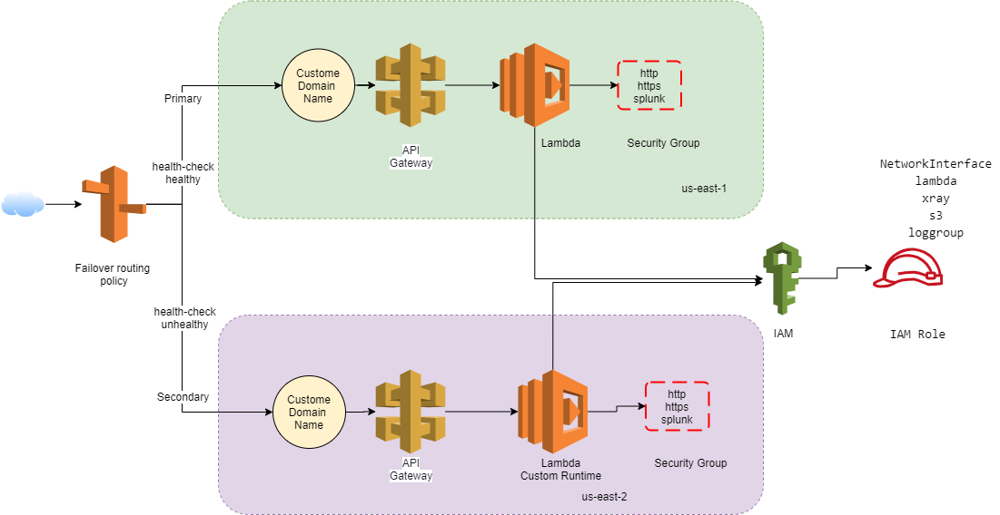

# Rest API using Lambda Function
Terraform module to create AWS Lambda and API gateway with {proxy+} integration.

This module was developed to support REST api with lambda function with a primary use case of running lambda with .NET Core 3.1, so most of the default variable are set with keeping that in mind. As of now the module has been tested with .NET Core 2.1, 2.2 and 3.1. In general this module just creates AWS infrastructure, so ideally any runtime environment should work.

# Extend Lambda IAM role
The module creates an IAM role for the lambda function and adds access to S3, ENI, lambda, xRay, log. These are common AWS services which is required for lambda to run. For adding any additional role policy, the module returns the AWS IAM role arn and it's name. You can use them in the calling module to add any additional policy like access to a specific dynamo table.

# Extend Lambda Security Group
The module creates a security group for the lambda function and add ingress rule for HTTP(80) and HTTPs(443) and add egress to access Splunk (8088). For any additional application-level ingress/egress rule, the module outputs security_group_id for the primary website and also for the secondary in case of failover. This will enable you to add additional security group rules, like opening port to access the SQL server. The SG id for the secondary lambda resource is returned as an array so you need to access it as [0].

# Known Issue
- Running this for the first time may take little extra time as AWS certificate validation can take anywhere up to 40 min
- Running this for the first time with failover fails with error about missing s3 bucket. Re-run it and it should be fine. Looking into it to find how to handle it. 
- Deleting security group which has been added to lambda function, takes a long time as security group is associated to network interface. You can manually associate the network interface and then it will be quick. 